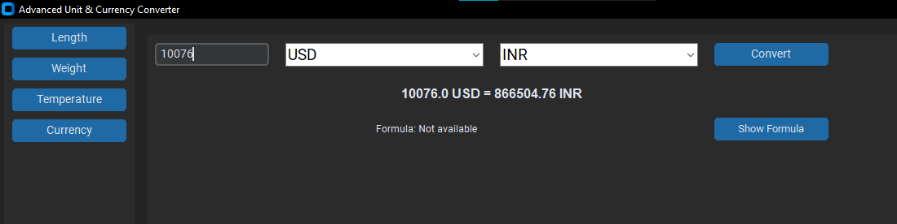

# 🔥 Advanced Unit & Currency Converter

A **modern, GUI-based unit and currency converter** built with **Python, Tkinter, and CustomTkinter** that supports:  
- 📏 **Length, Weight, Temperature, Currency Conversion**  
- 💰 **Live Currency Exchange Rates**  
- 📊 **Graphical Representation of Trends**  
- 📜 **Formula Display & Clipboard Copy**  
- 🎨 **Dark Mode with Modern UI**  


---

## 🎯 **Features**
### ✅ Supports All Major Units  
- **Length:** Meter, Kilometer, Mile, Yard, Foot  
- **Weight:** Gram, Kilogram, Pound, Ounce  
- **Temperature:** Celsius, Fahrenheit, Kelvin  
- **Currency:** USD, INR, EUR, GBP, JPY, CAD, AUD, CNY (Live rates)  

### 📈 Real-Time Currency Conversion  
- Fetches **live exchange rates** using `ExchangeRate-API`  
- Converts between multiple currencies instantly  

### 📊 Graphs & Charts  
- **Temperature Trends** 📉  
- **Currency Exchange Rate Charts** 💹  

### 📜 Formula Display  
- Shows the mathematical formula for each conversion  

### 🔍 Search & Filter  
- Find units easily using the search box  

### 📋 Copy to Clipboard  
- One-click **copy button** for quick use  

### ♻️ Reset Button  
- Clears all input fields with a single click  

---

## 🛠️ **Installation & Setup**
### 1️⃣ Install Dependencies  
Ensure Python 3.8+ is installed, then run:  
```bash
pip install -r requirements.txt
